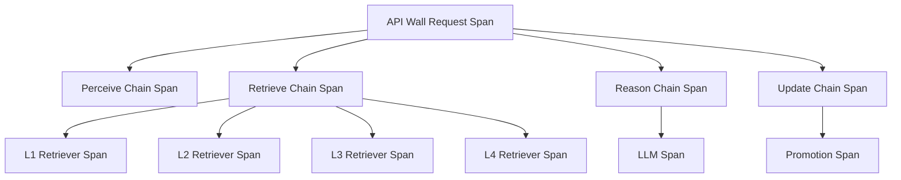

# RFC: Arize Phoenix Tracing for YAAM Glass-Box Observability

**Status:** Proposed  
**Date:** March 10, 2026  
**Audience:** Maintainers, observability owners, and reviewers  
**Related:** [ADR-003](../ADR/003-four-layers-memory.md), [ADR-007](../ADR/007-agent-integration-layer.md), [ADR-009](../ADR/009-decoupling-benchmark-api-wall.md), [ADR-010](../ADR/010-mechanism-policy-split-and-skills-v1.md), [Spec: Phoenix span contract](../specs/observability/phoenix-span-contract.md), [Concept 02: MAS Memory Inspector](../concept-02-memory-inspector.md), [Benchmark Use Cases](../benchmark_use_cases.md), [Phoenix API Wall Live Observability Validation Plan](../plan/2026-03-09-phoenix-api-wall-observability-validation-plan.md), [Phoenix API Wall Observability Progress Report](../reports/2026-03-09-phoenix-api-wall-observability-progress-report.md)

## 1. Purpose

This RFC defines the intended Arize Phoenix tracing strategy for the YAAM repository. The immediate objective is documentation and architectural alignment rather than implementation. The document therefore distinguishes rigorously between:

1. tracing capabilities already implemented in the repository,
2. tracing capabilities empirically validated during March 2026 live runs,
3. tracing requirements implied by YAAM architecture and benchmark usage,
4. and tracing enhancements proposed for later implementation.

The motivating requirement is stronger "glass box" observability for YAAM cognition. The desired outcome is not merely request timing or trace identifiers, but a trace graph that exposes:

1. what YAAM agents did (workflow stages and decisions),
2. how information was retrieved from and written to L1-L4,
3. and how LLM-dependent modules behaved (e.g., CIAR scoring, fact extraction, consolidation/distillation prompts).

Benchmark-related trace correlation is treated as a transitional development concern rather than a production objective because the benchmark harness is expected to be removed from the repository distribution when YAAM enters a production lifecycle.

## 2. Background

Arize Phoenix is an observability platform for LLM applications built on OpenTelemetry and the OpenInference semantic conventions. The upstream Phoenix model supports:

1. project-level grouping of traces,
2. session-level grouping of multi-turn interactions,
3. automatic or manual instrumentation of LLM providers and frameworks,
4. semantic span kinds such as `LLM`, `CHAIN`, `RETRIEVER`, `AGENT`, and `TOOL`,
5. span metadata for prompts, invocation parameters, retrieved documents, token counts, prompt templates, tags, and arbitrary metadata,
6. and post-hoc annotations or evaluations attached to traces and spans.

In Phoenix terminology, a useful YAAM trace should therefore represent a single end-to-end request as a rooted trace with semantically meaningful child spans rather than as an opaque request envelope containing only aggregate timing.

External references:

1. Arize Phoenix "Setup Tracing" documentation: <https://arize.com/docs/phoenix/tracing/how-to-tracing/setup-tracing> (accessed March 10, 2026).
2. Arize Phoenix repository: <https://github.com/Arize-ai/phoenix> (accessed March 10, 2026).

Normative contract reference:

1. [Spec: Phoenix span contract](../specs/observability/phoenix-span-contract.md) defines the span inventory, required attributes, and code attachment points for YAAM glass-box observability.

### 2.1 OpenInference semantic vocabulary (normative keys)

This RFC treats the OpenInference semantic conventions as normative for span kinds and core
attributes. The following keys are expected to be used consistently when emitting spans that
Phoenix should interpret as LLM/application-level telemetry.

**Span kind**

- `openinference.span.kind`: One of `AGENT`, `CHAIN`, `RETRIEVER`, `LLM`, `TOOL` (and other OpenInference kinds).

**Correlation and high-level I/O**

- `session.id`: YAAM session identifier (`yaam_session_id`).
- `user.id`: Stable user identifier when available (optional).
- `input.value`: User-facing input at the boundary where it is meaningful (e.g., user message for `run_turn`).
- `output.value`: User-facing output at the boundary where it is meaningful (e.g., final assistant response).
- `tag.tags`: Optional tags used for grouping and slicing traces (e.g., agent variant, experiment id).

**Graph/phase structure**

- `graph.node.id`, `graph.node.parent_id`, `graph.node.name`: Use to represent a YAAM workflow DAG (e.g., LangGraph nodes).

**Retrieval evidence**

- `retrieval.documents`: An indexed list of retrieved documents/snippets.
- `document.id`, `document.content`, `document.score`, `document.metadata`: Per-document fields for retrieval transparency.

**LLM calls**

- `llm.provider`, `llm.model_name`: Provider and effective model.
- `llm.invocation_parameters`: Temperature, max tokens, structured-output schema pointers, etc.
- `llm.input_messages`, `llm.output_messages`: Message arrays for chat-style interactions where capture is permitted.
- `llm.prompt_template.template`, `llm.prompt_template.version`, `llm.prompt_template.variables`: Prompt-template governance fields.
- `llm.token_count.prompt`, `llm.token_count.completion`, `llm.token_count.total`: Token accounting fields.

## 3. Current Repository State

### 3.1 Implemented Phoenix initialization

Phoenix initialization is currently implemented in [src/llm/client.py](../../src/llm/client.py).

The present behavior is as follows:

1. Phoenix tracing is enabled when `PHOENIX_COLLECTOR_ENDPOINT` is set.
2. Project naming defaults to `mlm-mas-dev` and may be specialized by `AGENT_TYPE` or explicit `PHOENIX_PROJECT_NAME`.
3. The repository registers a Phoenix tracer provider through `phoenix.otel.register(...)`.
4. Google GenAI instrumentation is attempted explicitly through `GoogleGenAIInstrumentor`.
5. Initialization is guarded to reduce repeated tracer-provider registration and the associated OpenTelemetry override warning.

This means Phoenix is not merely conceptual in the repository. It is already part of runtime initialization for YAAM-serving processes.

### 3.2 Implemented API Wall root tracing

The current root request tracing model is implemented in [src/server.py](../../src/server.py).

The API Wall currently provides:

1. a request-level root span named `yaam.api_wall.chat_completions`,
2. extraction of inbound `traceparent` headers when supplied,
3. request-span attributes for route, agent type, agent variant, configured model, request model, session id, turn id, prompt tokens, and timing metadata,
4. error capture on the request span,
5. and response metadata containing `yaam_trace_id` and `yaam_span_id`.

This is the strongest implemented tracing surface in the repository today. It establishes a stable request boundary and a consistent trace-correlation contract for downstream consumers.

### 3.3 Implemented span annotation (attributes only)

The repository can attach agent metadata to the currently active span (typically the API Wall root
span) without creating additional child spans.

This behavior is implemented in [src/llm/client.py](../../src/llm/client.py) through the
`agent_metadata` mechanism, and is used by YAAM agents to attach coarse-grained attribution
attributes such as agent type, session id, turn id, and variant.

This mechanism is useful for trace slicing, but it does not satisfy the "glass box" requirement by
itself because it does not create semantic spans for retrieval, lifecycle, or workflow phases.

### 3.4 Implemented benchmark metadata preservation (transitional)

The GoodAI benchmark integration currently preserves YAAM tracing metadata rather than creating benchmark-owned spans.

The relevant behavior is implemented in:

1. `model_interfaces/remote_agent.py` in the external `goodai-ltm-benchmark-yaam` repository,
2. `runner/scheduler.py` in the external benchmark repository,
3. and `runner/master_log.py` in the external benchmark repository.

The benchmark currently propagates and persists (sanitized) YAAM response metadata that may include:

1. `yaam_trace_id`,
2. `yaam_span_id`,
3. `yaam_session_id`,
4. `client_session_id`,
5. `yaam_configured_model`,
6. `llm_provider`,
7. `llm_model`,
8. and aggregate latency fields such as `llm_ms` and `storage_ms`.

This is sufficient to pivot from benchmark artifacts into Phoenix for a given turn. However:

1. the benchmark does not supply `traceparent` to YAAM and therefore does not create benchmark-owned parent spans,
2. `TurnMetrics` currently focuses on latency/token counters and does not act as the authoritative store for trace identifiers,
3. and the benchmark integration should be treated as a development harness rather than a long-term architectural dependency.

### 3.5 Implemented memory telemetry and metrics

The memory subsystem already emits internal observability signals, but most of them are not currently represented as Phoenix traces.

Relevant files include:

1. [src/memory/tiers/base_tier.py](../../src/memory/tiers/base_tier.py),
2. [src/memory/unified_memory_system.py](../../src/memory/unified_memory_system.py),
3. [src/memory/tiers/episodic_memory_tier.py](../../src/memory/tiers/episodic_memory_tier.py),
4. [src/memory/engines/base_engine.py](../../src/memory/engines/base_engine.py),
5. and [src/storage/metrics/collector.py](../../src/storage/metrics/collector.py).

The current observability model here consists primarily of:

1. metrics collection for operation duration and success or failure,
2. lifecycle telemetry stream events for tier access,
3. agent metadata stored into request metadata,
4. and aggregate timing for retrieval and promotion operations.

This is valuable for diagnostics, but it is not yet aligned with Phoenix's OpenInference span model.

### 3.6 Validated March 2026 live behavior

Live validation in March 2026, documented in [Phoenix API Wall Observability Progress Report](../reports/2026-03-09-phoenix-api-wall-observability-progress-report.md), shows that:

1. direct API Wall tracing was validated for Gemini, Groq, and Mistral,
2. the benchmark `mas-remote` path preserved Phoenix correlation metadata for all three providers,
3. API Wall request spans were visible in Phoenix and matched returned `yaam_trace_id` values,
4. and benchmark artifacts could be correlated with Phoenix traces on a per-turn basis.

This evidence is sufficient to classify request-level Phoenix tracing and benchmark trace-id preservation as implemented and empirically validated.

## 4. Current Limitations

### 4.1 Phoenix visibility is shallow inside YAAM cognition

The current trace graph is dominated by request-level spans and provider-level spans. It does not yet expose the internal YAAM cognitive path in a first-class way.

In particular, Phoenix does not currently present:

1. explicit retriever spans for L1, L2, L3, and L4 access,
2. explicit spans for `get_context_block(...)` and `query_memory(...)`,
3. explicit lifecycle spans for promotion, consolidation, or distillation,
4. explicit CIAR decision attributes on spans,
5. or explicit agent-workflow spans for perception, retrieval, reasoning, update, and response.

### 4.2 Benchmark is a trace consumer, not a trace producer

The benchmark currently records YAAM tracing metadata but does not own parent spans describing benchmark execution itself.

Missing benchmark-side capabilities include:

1. run-level spans,
2. per-turn parent spans rooted in benchmark execution,
3. span attributes for dataset name, test id, example id, and run id,
4. and explicit benchmark-to-YAAM span hierarchy.

### 4.3 Provider instrumentation hardening is incomplete

The repository currently declares Phoenix dependencies in [pyproject.toml](../../pyproject.toml), including:

1. `arize-phoenix`,
2. `openinference-instrumentation-google-genai`,
3. and `opentelemetry-exporter-otlp`.

However, the repository does not presently declare provider-specific OpenInference packages for Groq or Mistral. This means that Groq and Mistral tracing should be regarded as validated at the API Wall boundary but not yet dependency-hardened as a repository guarantee.

### 4.4 Documentation drift exists

Some repository documents describe observability in more ambitious terms than the implementation currently supports. For example:

1. [Concept 02: MAS Memory Inspector](../concept-02-memory-inspector.md) describes glass-box cognitive telemetry,
2. [Benchmark Use Cases](../benchmark_use_cases.md) expects detailed instrumentation for the full transaction,
3. and benchmark visibility documents call for richer headless observability.

These documents are directionally aligned with the proposed Phoenix strategy, but they should not be read as proof that those capabilities already exist in the implementation.

## 5. Requirements

### 5.1 YAAM core requirements

The YAAM runtime should ultimately satisfy the following tracing requirements.

| Requirement | Current State | Target State |
|---|---|---|
| Request root span at API Wall | Implemented and validated | Retain |
| LLM child spans with provider, model, tokens, and invocation metadata | Partial and provider-dependent | Fully standardized |
| Session-level grouping across multi-turn conversations | Partial through `yaam_session_id` metadata | Native Phoenix session semantics |
| Retriever spans for L1-L4 access | Not implemented in Phoenix | Implemented |
| Workflow spans for perceive, retrieve, reason, update, respond | Not implemented | Implemented |
| Lifecycle spans for promotion, consolidation, and distillation | Not implemented | Implemented |
| CIAR and retrieval-result metadata visible on spans | Aggregate metadata only | Implemented |
| Prompt-template metadata | Not implemented | Implemented where applicable |
| Tool spans for future skill wiring | Not implemented | Implemented when tool execution is enabled |

### 5.2 Transitional benchmark requirements (development only)

The benchmark integration is treated as a transitional development harness and is expected to be
excluded from the repository distribution when YAAM enters a production lifecycle. The following
requirements are therefore development-only and should not drive mechanism-layer design.

| Requirement | Current State | Target State |
|---|---|---|
| Preserve YAAM trace identifiers in benchmark artifacts | Implemented and validated | Retain |
| Link benchmark turn records to Phoenix sessions and traces | Partial | Formalized |
| Emit benchmark-owned parent spans | Not implemented | Implemented |
| Attach run id, dataset name, test id, and example id to spans | Not implemented | Implemented |
| Preserve per-turn latency and token metrics outside Phoenix | Implemented | Retain |
| Correlate benchmark failures with Phoenix traces | Partial | Implemented systematically |

### 5.3 Additional capabilities requirements

The repository should also plan for additional capabilities supported by the Phoenix model.

| Capability | Value to YAAM | Priority |
|---|---|---|
| Prompt-template capture | Supports prompt governance and prompt-drift analysis | Medium |
| Retrieved-document payload capture | Supports inspection of L3 and L4 evidence actually supplied to the model | High |
| Tool-call tracing | Supports future skills and gated tool execution | Medium |
| Trace annotations and evaluations | Supports benchmark diagnosis and quality review in Phoenix | Medium |
| Privacy-aware redaction policy | Supports safe future deployment beyond controlled benchmark environments | High |

## 6. Gap Analysis

### 6.1 What is already done

The following capabilities are already done and should be treated as repository baseline:

1. Phoenix initialization exists and is environment-configurable.
2. The API Wall emits request-level Phoenix spans.
3. Request responses expose `yaam_trace_id` and `yaam_span_id`.
4. The benchmark `mas-remote` path can preserve Phoenix correlation metadata (transitional).
5. Live March 2026 validation confirmed direct and benchmark-path trace correlation for Gemini, Groq, and Mistral.

### 6.2 What remains absent or incomplete

The following capabilities remain absent or incomplete:

1. OpenInference retriever spans for memory-tier access.
2. OpenInference chain or agent spans for YAAM workflow phases.
3. Lifecycle spans for promotion, consolidation, and distillation.
4. Benchmark-owned parent spans and structured benchmark metadata on spans.
5. A formal privacy and redaction policy for prompts and retrieved content.
6. Explicit dependency hardening for Groq and Mistral provider instrumentation.

### 6.3 Architectural interpretation of the gap

The principal gap is not a lack of observability intent. The repository already contains intent in design documents and metrics in runtime code. The principal gap is representational: the current implementation stores timing and metadata outside the Phoenix semantic span graph.

In practical terms, Phoenix can currently answer questions such as:

1. whether a given API Wall request reached Phoenix,
2. which configured model and effective provider served the request,
3. and how long aggregate LLM and storage phases took.

Phoenix cannot yet answer, in a semantically structured manner:

1. what YAAM retrieved from L1, L2, L3, and L4,
2. why a fact was promoted or filtered,
3. which CIAR values informed memory selection,
4. how lifecycle engines transformed state between tiers,
5. or which evaluation example or dataset property caused a failure pattern (development-only).

## 7. Proposed Target Architecture

### 7.1 Root span ownership

The API Wall should remain the canonical root span owner for request-serving traces.

This preserves the architectural boundary established in [ADR-009](../ADR/009-decoupling-benchmark-api-wall.md) and avoids conflating external benchmark orchestration with internal YAAM request execution.

### 7.2 YAAM semantic span model

The recommended target span hierarchy for a single request is:

1. root request span at the API Wall,
2. child chain or agent spans for workflow phases,
3. child retriever spans for memory retrieval operations,
4. child LLM spans for model invocations,
5. and child lifecycle spans for post-response promotion or consolidation when those operations occur synchronously inside the request boundary.

Illustrative logical structure:

### 7.3 Memory-system tracing boundary

The preferred implementation boundary for future tracing is above the frozen mechanism layer. Initial tracing work should attach at:

1. [src/server.py](../../src/server.py),
2. [src/agents/memory_agent.py](../../src/agents/memory_agent.py),
3. [src/agents/rag_agent.py](../../src/agents/rag_agent.py),
4. [src/memory/unified_memory_system.py](../../src/memory/unified_memory_system.py),
5. [src/memory/tiers](../../src/memory/tiers),
6. and [src/memory/engines](../../src/memory/engines).

This respects [ADR-010](../ADR/010-mechanism-policy-split-and-skills-v1.md), which treats [src/storage](../../src/storage) as mechanism and frozen-by-default.

### 7.4 Metadata strategy

The repository should preserve current `yaam_*` metadata for backward compatibility while gradually adding OpenInference-aligned attributes.

Recommended attribute groups include:

1. session and conversation identifiers,
2. agent type and variant,
3. optional evaluation harness identifiers (run id, dataset name, test id, example id),
4. CIAR thresholds and selected CIAR scores,
5. retrieval counts by tier,
6. prompt template version and variables,
7. and provider-routing metadata when fallback or rerouting occurs.

### 7.5 Privacy and content-capture policy

The target architecture should support full content capture in controlled development and evaluation
environments because the explicit project requirement is to inspect LLM calls and retrieved
information from YAAM layers.

However, the design should also define a future privacy policy with at least three modes:

1. full capture for development and evaluation diagnostics,
2. redacted capture for production-like environments,
3. and metadata-only capture for highly restricted contexts.

## 8. Phased Rollout Proposal

### Phase 1: Trace hardening and metadata normalization

Objectives:

1. stabilize provider instrumentation guarantees,
2. standardize model and provider metadata naming,
3. and eliminate known request-model or response-model inconsistencies across YAAM clients.

Expected outcome:

Phoenix remains request-rooted but becomes a stronger source of truth for provider and model attribution.

### Phase 2: YAAM memory retrieval spans

Objectives:

1. add retriever spans around `get_context_block(...)` and `query_memory(...)`,
2. add tier-specific spans or structured child events for L1-L4 access,
3. and attach retrieval counts, scores, and selected evidence metadata.

Expected outcome:

Phoenix begins to expose what YAAM actually retrieved rather than only how long retrieval took.

### Phase 3: Lifecycle and workflow spans

Objectives:

1. add chain or agent spans for workflow stages,
2. add spans for promotion, consolidation, and distillation,
3. and expose CIAR-driven decisions and promotion outcomes in Phoenix.

Expected outcome:

Phoenix becomes a first-class view of YAAM cognitive flow rather than an API envelope.

### Phase 4 (optional): Evaluation harness spans and overlays

Objectives:

1. emit evaluation harness parent spans (when such a harness is present),
2. attach run and dataset metadata to harness and request spans,
3. and explore annotations or evaluation overlays in Phoenix for failure analysis.

Expected outcome:

Operators can move bidirectionally between benchmark artifacts and Phoenix trace graphs.

## 9. Verification Criteria for Future Implementation

The future implementation should be considered complete only when the following statements are true.

1. A single Phoenix trace can show the request root, LLM invocation, and memory retrieval from applicable YAAM layers.
2. YAAM responses can be correlated to Phoenix traces without manual guesswork.
3. CIAR-informed memory-selection behavior is visible in trace metadata or child spans.
4. At least one lifecycle operation, such as promotion, is visible as a semantic span rather than only a timing field.
5. Provider routing and model identity are consistent across API responses and Phoenix span attributes.

## 10. Risks and Trade-offs

### Positive consequences

1. YAAM observability will become materially closer to the glass-box objective described in [Concept 02](../concept-02-memory-inspector.md).
2. Evaluation debugging will become faster and more defensible.
3. The project will gain stronger evidence for research and review contexts because internal memory behavior will be inspectable.

### Negative consequences

1. Richer tracing may increase overhead if implemented indiscriminately.
2. Capturing retrieved documents and prompts can increase privacy sensitivity.
3. Span-schema design that is too YAAM-specific could reduce future interoperability if not aligned with OpenInference conventions.

### Neutral implementation considerations

1. Some current metrics pipelines should remain in place even after Phoenix enhancement because metrics and traces serve different operational purposes.
2. Evaluation harnesses should retain JSONL artifact generation even if Phoenix coverage improves, because Phoenix is not a replacement for all evaluation reporting outputs.

## 11. Recommendation

The repository should adopt Phoenix as the canonical tracing substrate for YAAM request execution while expanding the trace model from request-level visibility to memory-aware cognitive visibility.

The present implementation already justifies an architectural commitment because the request root and
trace-correlation path are real and validated. The recommended next step is therefore not a fresh
proof-of-concept, but a disciplined extension of the existing Phoenix integration into YAAM
retrieval, lifecycle, and workflow semantics.

No code changes are authorized by this RFC. It is a planning and alignment document intended to guide later implementation.
