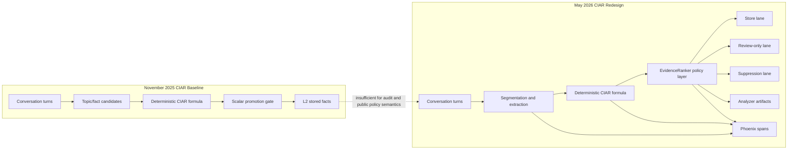
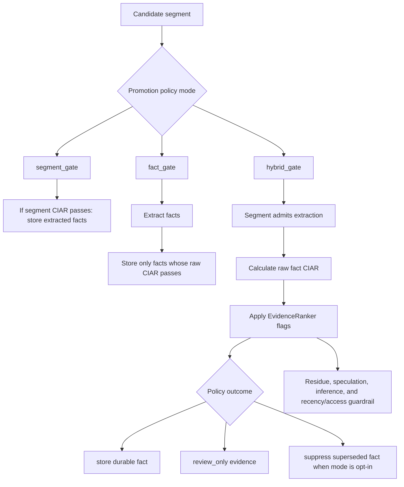
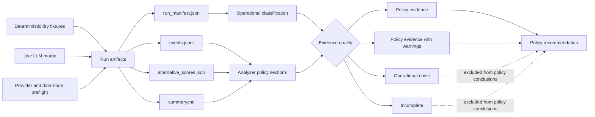
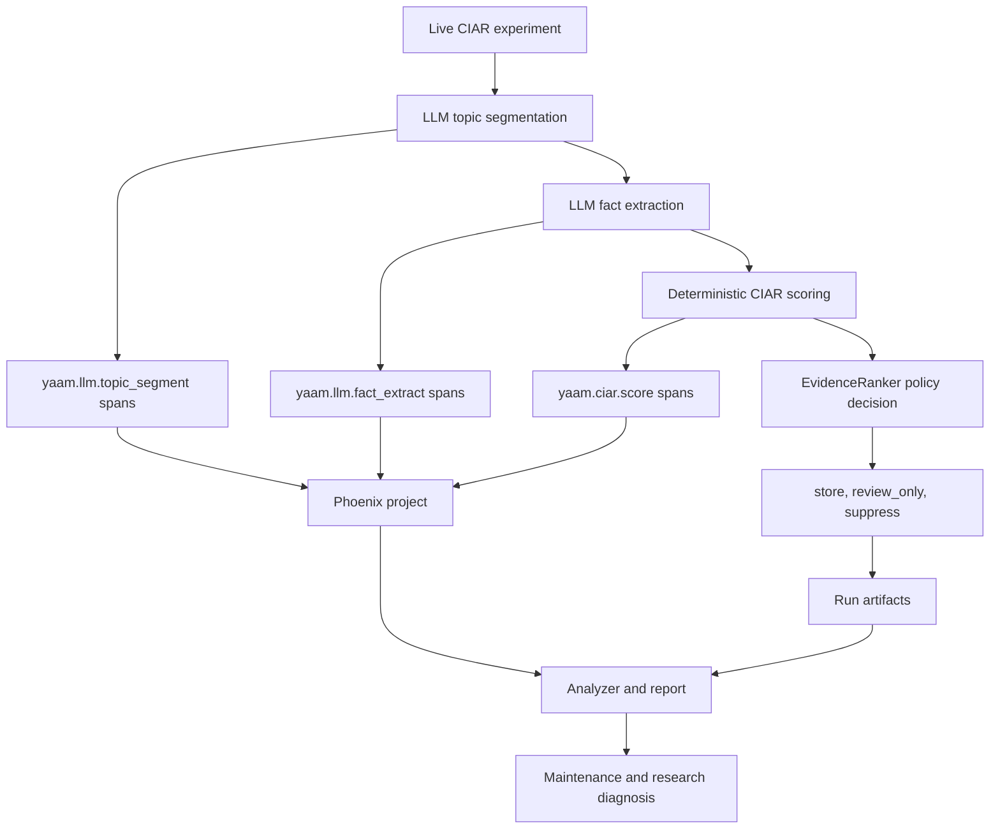

# CIAR Redesign As Auditable Memory Policy: Research Artifact For The YAAM Journal Article

**Status:** Research note for future journal article  
**Date:** 2026-05-30  
**Scope:** CIAR redesign, policy selection, experiment evidence, consumer requirements, and Phoenix observability  
**Related MCP note:** [From Service-Bound Memory To Adaptive Agent-Host Interfaces](2026-05-30-yaam-mcp-evolution-and-domain-pack-extensibility.md)

## Abstract

This note records the redesign of CIAR in YAAM from a scalar promotion score into an auditable memory-policy layer. In the November 2025 baseline, CIAR already existed as a deterministic score for memory promotion, but it was not yet supported by a mature experiment harness, explicit policy modes, contradiction evaluation, review-only evidence handling, operational classification, or Phoenix-based trace analysis. The May 2026 redesign addressed these gaps through a sequence of controlled batches: formula conformance, promotion-policy comparison, contradiction and supersession handling, residue filtering, speculative-claim review, recency/access guardrails, deterministic regression coverage, live LLM checkpoints, and Phoenix span export.

The resulting design keeps the CIAR formula deterministic while moving storage decisions into a richer policy layer. The selected default, `hybrid_gate`, uses CIAR to admit candidate evidence but applies additional evidence-quality rules before deciding whether a fact should be stored, marked `review_only`, or suppressed as superseded. The redesign was informed by external requirements from YAAM consumer projects, including TRA, iAIMS, Skill Factory, SCM Cognitive Sandwich, Maritime Port Sandbox, and SCM-Cert-Bench. These projects require scoped memory, provenance, Evidence Table generation, CIAR explanation, partial-result warnings, contradiction inspection, and Phoenix-auditable operations.

The main evidence is behavioral and operational rather than a final task-performance benchmark. Dry-run fixtures demonstrate deterministic policy behavior for repeated corrections, conversational residue, speculative claims, and access-boosted weak evidence. A six-run live LLM matrix using `tencent/hy3-preview` completed as clean policy evidence and supported keeping `hybrid_gate` as the promotion default while leaving `suppress_superseded` opt-in. Phoenix observability supplied 201 exported spans across the live policy-refresh matrix, with zero exported span errors, and now functions as a scientific instrumentation layer for distinguishing CIAR policy effects from provider failures, setup failures, missing artifacts, and live extraction variance.

## 1. Historical Baseline: CIAR Before The Redesign

The November 2025 version of YAAM already contained the conceptual and implementation roots of CIAR. The system had a four-tier memory architecture, an L2 working-memory tier, emerging L3 and L4 persistence, infrastructure verification scripts, and early multi-provider LLM support. CIAR was implemented as a deterministic score for deciding whether information should be promoted from short-lived conversational context into more durable memory.

The core idea was defensible: memory promotion should not depend only on semantic similarity or recency. YAAM needed a score that combined certainty, impact, age decay, and recency/access reinforcement. The normative formula later stabilized as:

```text
CIAR = clamp((certainty * impact) * exp(-lambda * age_days) * (1 + alpha * access_count), 0, 1)
```

This made CIAR cheap, inspectable, and reproducible. However, the original role of CIAR was too narrow and too compressed. It treated several distinct concerns as one scalar: belief quality, operational importance, retention priority, source provenance, contradiction state, and retrieval utility. That was acceptable for an early L1 to L2 promotion gate, but insufficient for YAAM as a public research infrastructure component.

The May 18 audit made this limitation explicit. It concluded that CIAR should remain a deterministic retention signal, but should not be presented as a complete cognitive memory policy. The audit also identified concrete implementation issues: fact scores could be floored to the promotion threshold, segment-level scoring could dominate fact-level quality, feature provenance was not sufficiently visible, contradiction handling was outside CIAR, and agent-facing tools were useful but not yet product-ready as public MCP contracts.

The external review feedback preserved in [docs/notes/28-03-2026-emas-openreview-response.md](28-03-2026-emas-openreview-response.md) further sharpened the problem. Reviewers noted that CIAR was central to the paper but inadequately formalized, that empirical evidence was underspecified, and that strong claims about memory stabilization required more quantitative or at least more structured evidence. In response, the May 2026 work changed CIAR from a mostly internal scoring concept into a traceable, tested, and reportable policy subsystem.



## 2. Problem Statement And External Research Requirements

The CIAR redesign was not only an internal cleanup. It became necessary because YAAM was evolving from a memory subsystem into shared research infrastructure. The MCP planning work recorded in [docs/notes/2026-05-30-yaam-mcp-evolution-and-domain-pack-extensibility.md](2026-05-30-yaam-mcp-evolution-and-domain-pack-extensibility.md) shows the broader interface shift: YAAM now has to serve API Wall, REST v2, and MCP consumers without exposing storage internals or collapsing policy into mechanism.

The requirements registry in [docs/requirements/yaam-requirements-registry.md](../requirements/yaam-requirements-registry.md) gathered needs from six consumer systems: TRA, iAIMS, Skill Factory, SCM Cognitive Sandwich, Maritime Port Sandbox, and SCM-Cert-Bench. Several accepted requirements directly shaped the CIAR redesign:

| Requirement | CIAR consequence |
| --- | --- |
| `YAAM-REQ-0009`: provenance on reads and writes | CIAR decisions must preserve source, tier, score, and policy metadata. |
| `YAAM-REQ-0014`: Phoenix-auditable operations | CIAR scoring, extraction, and policy behavior must be traceable. |
| `YAAM-REQ-0016`: Evidence Table generation | CIAR must support evidence explanation, not only hidden storage decisions. |
| `YAAM-REQ-0017`: CIAR explanation with components and policy metadata | Outputs must include certainty, impact, age decay, recency boost, final score, and review/suppression status. |
| `YAAM-REQ-0018`: partial results with warnings | Operational degradation must be separated from policy evidence. |
| `YAAM-REQ-0029`: contradiction/supersession as opt-in | Supersession policy should be available and inspectable, but not silently defaulted. |
| `YAAM-REQ-0034`: performance budgets and observability | CIAR evaluation must be testable, repeatable, and operationally diagnosable. |

These requirements changed the success criteria. A scalar score was no longer enough. YAAM needed to answer questions such as:

- Was this run usable policy evidence or operational noise?
- Did the model fail to extract a fact, or did CIAR reject it?
- Was a fact rejected because it was low-value chatter, assistant self-description, speculation, or weak evidence boosted by access?
- Did contradiction handling suppress old facts while preserving current facts?
- Can Phoenix reconstruct the segmentation, extraction, scoring, and promotion path?
- Can external consumers inspect CIAR decisions through a stable interface without depending on storage internals?

The redesign therefore targeted a stronger property: auditable memory policy. The formula remained the deterministic base signal, but storage behavior moved into an evidence-aware policy layer.

## 3. Hypotheses And Design Alternatives

The May 2026 work evaluated several policy hypotheses rather than assuming that the original promotion behavior was correct.

| Hypothesis | Result | Reason |
| --- | --- | --- |
| Keep `segment_gate` as the main behavior | Rejected as default | It admits facts because the segment is important, even when individual extracted facts are residue or weak evidence. |
| Use `fact_gate` as the default | Rejected as default | It is stricter, but it discards borderline evidence instead of preserving a reviewable audit lane. |
| Use `hybrid_gate` as the default | Accepted | It combines segment-level extraction admission with fact-level evidence policy and review-only artifacts. |
| Make `suppress_superseded` the contradiction default | Deferred | Dry evidence is strong, but live behavior remains extraction-sensitive. |
| Keep contradiction default `off` and make suppression opt-in | Accepted | This preserves backward-compatible behavior while allowing focused suppression experiments. |
| Treat provider or setup failures as ordinary failed policy evidence | Rejected | Operational failures must be classified separately from policy behavior. |
| Rely only on console logs for live evaluation | Rejected | Future experiments need structured manifests, analyzer output, and Phoenix spans. |

The critical policy choice was `hybrid_gate`. It accepts that segment-level scoring remains useful because important operational updates are often expressed across multiple turns. However, it refuses to treat every fact extracted from a high-impact segment as durable memory. Instead, it applies evidence-quality flags after raw CIAR scoring.



This design is important for a future journal article because it turns CIAR into a decomposable policy stack. The deterministic formula is still explainable, but the final action is no longer a single threshold comparison.

## 4. Selected Policy Architecture

The selected architecture separates formula-level CIAR from policy-level CIAR.

Formula-level CIAR computes a score from components. It answers: "How strong is this fact as a retention candidate, given certainty, impact, age decay, and access reinforcement?"

Policy-level CIAR decides how the system should treat the candidate. It answers: "Should this evidence be stored, reviewed, suppressed, or treated as operationally inconclusive?"

The selected default is:

```text
promotion_policy_mode = hybrid_gate
contradiction_policy_mode = off
```

The selected opt-in contradiction mode is:

```text
contradiction_policy_mode = suppress_superseded
```

This decision was supported by the final policy refresh report. All six live runs completed as `policy_evidence`, and the recommendation was to keep `hybrid_gate` as the promotion default, keep contradiction default `off`, and keep `suppress_superseded` opt-in until current-fact preservation is more robust across both canonical suppression scenarios.

The policy architecture has three principal evidence lanes:

1. **Store lane:** durable operational or user-confirmed facts that pass CIAR and evidence-quality checks.
2. **Review-only lane:** facts that are extracted and visible in artifacts, but not stored as durable memory because they are residue, speculative, assistant-inferred, or weak base evidence boosted by access.
3. **Suppression lane:** prior facts that are explicitly superseded under the opt-in contradiction policy.

This architecture directly addresses the reviewer critique that the paper needed clearer mechanism definitions and stronger evidence. It also avoids a false binary between "store" and "discard." In an auditable research system, rejected evidence can still be scientifically useful if it is recorded as review-only.

## 5. Implementation Summary

The redesign was implemented through a sequence of narrowly scoped batches. The batches were intentionally constrained: they did not change storage adapters, database schemas, provider routing defaults, dependencies, or `.env` behavior. The work focused on policy, harnesses, tests, analyzer output, and observability.

| Batch | Main contribution | Research relevance |
| --- | --- | --- |
| Batch 1: operational classification | Added `operational_classification` to run manifests and analyzer output. | Separates policy evidence from operational noise. |
| Batch 7: CIAR regression pack | Added a canonical local CIAR verification command. | Makes future CIAR work reproducible. |
| Batch 2: repeated correction repair | Made `repeated_correction` deterministic in dry runs. | Provides a stable supersession fixture. |
| Batch 3: focused suppression evaluation | Added suppression-focused analyzer output. | Measures contradiction behavior by scenario and policy mode. |
| Batch 4: residue tightening | Review-only classification for assistant acknowledgements and chatter. | Reduces conversational noise in durable memory. |
| Batch 5: speculative claims review-only | Review-only classification for speculative and assistant-inferred facts. | Prevents weak inference from becoming durable fact. |
| Batch 6: recency/access guardrail | Prevents access reinforcement alone from storing weak base evidence. | Keeps recency/access from overpowering evidence quality. |
| Live repeated-correction robustness | Improved fixture wording and segment-gate diagnostics for live runs. | Makes suppression behavior more observable with LLM extraction. |
| Provider-health/setup isolation | Added lifecycle cleanup and setup diagnostics. | Distinguishes Redis/L1 setup issues from provider-health side effects. |
| Policy recommendation refresh | Ran six live policy-refresh runs and exported Phoenix spans. | Produced the final default-policy recommendation. |

The main logic change is the addition of evidence-quality policy on top of deterministic CIAR. The system now detects and records categories that the original scalar gate could not distinguish:

- assistant-action residue, such as "assistant confirmed" or "I will record";
- low-value chatter and acknowledgements;
- speculative claims, such as "might", "maybe", "possibly", "unconfirmed", or "suspected";
- assistant inference, such as "likely prefers" without explicit user confirmation;
- weak base evidence that crosses the threshold only because of recency/access reinforcement;
- superseded prior facts under opt-in contradiction policy.

The redesign also improved experiment artifacts. Runs now include structured manifests, summaries, events, alternative scores, operational classification, and analyzer sections for suppression, residue, speculative review, and recency/access guardrail behavior. This matters because future paper claims can cite run artifacts rather than informal console observations.

## 6. Validation Methodology

The validation methodology combined deterministic dry runs, live LLM checkpoints, analyzer aggregation, Phoenix span export, and regression tests.



Dry runs were used for deterministic acceptance because they remove provider variability and allow exact expected counts. Live runs were used for ecological validity because actual segmentation and extraction behavior depends on LLM responses. Operational classification was necessary because live failures can be caused by provider health, Redis setup, Phoenix reachability, missing artifacts, or cleanup problems rather than CIAR policy itself.

The local test strategy included:

- unit tests for the CIAR scorer and formula behavior;
- promotion-engine tests for evidence-quality flags and policy outcomes;
- contradiction-policy tests for supersession behavior;
- script tests for challenge harness classification and analyzer aggregation;
- a canonical CIAR regression pack;
- full repository test suites after changes that touched `src/`.

Recent validation after the merge confirmed the current branches with:

```text
CIAR regression pack: 156 passed
Full suite: 674 passed, 139 skipped
```

The skipped tests are integration or live-provider tests that require explicit runtime credentials or `--run-integration`.

## 7. Dry-Run Evidence

Dry-run evidence is the strongest support for deterministic policy behavior because it controls segmentation and extraction.

The repeated-correction repair established a canonical correction chain for shipment `ALFA-4421`: Oakland, then Los Angeles, then Long Beach. Under `hybrid_gate + suppress_superseded`, the dry run produced:

| Scenario | Segments promoted | Facts extracted | Facts promoted | Facts suppressed |
| --- | ---: | ---: | ---: | ---: |
| `repeated_correction` | 1 | 3 | 1 | 2 |

The stored fact was the current Long Beach route. The suppressed facts were the superseded Oakland and Los Angeles routes. This provides a clear local demonstration that suppression can preserve the latest correction while removing obsolete facts from durable promotion.

The focused suppression evaluation compared `off`, `metadata_only`, and `suppress_superseded` on `contradiction_update` and `repeated_correction`. Under `hybrid_gate+off` and `hybrid_gate+metadata_only`, no facts were suppressed. Under `hybrid_gate+suppress_superseded`, `contradiction_update` promoted one and suppressed one, while `repeated_correction` promoted one and suppressed two. This shows that suppression is a policy choice, not a side effect of CIAR arithmetic.

The residue tightening batch demonstrated that conversational residue can be extracted but not stored:

| Scenario | Expected behavior |
| --- | --- |
| `small_talk` | No promoted facts. |
| `assistant_acknowledgement_noise` | No promoted facts. |
| `segment_mismatch` | Operational fact promoted, chatter residue review-only. |
| `urgent_with_chatter` | Urgent operational fact promoted, assistant/chatter residue review-only. |

The speculative-claim batch showed that uncertain or assistant-inferred facts become review-only under `hybrid_gate`, while explicit user-confirmed facts remain store-eligible. In the focused dry run, both `speculative_claim` and `assistant_inferred` reached extraction and produced one review-only fact each, while positive controls such as `clear_constraint` and `urgent_event` promoted normally.

The recency/access guardrail showed that access reinforcement cannot by itself turn weak base evidence into durable memory under `hybrid_gate`. The dry scenario `access_reinforced_low_signal` produced one extracted fact, zero promoted facts, and one review-only row with `recency_access_guardrail=true`.

These dry results do not prove downstream agent-task improvement. They prove a narrower but essential property: CIAR policy behavior is deterministic, inspectable, and aligned with the intended memory semantics.

## 8. Live LLM Evidence

Live validation used OpenRouter model `tencent/hy3-preview`, 4096-dimensional Qwen embeddings in the broader YAAM runtime, required provider health where appropriate, current `.env` service URLs, and Phoenix project names for trace separation. The important point is not only that a stronger model and larger embeddings were used. The model upgrade made live segmentation and extraction more viable, but the core contribution was the policy and observability redesign around those LLM-dependent features.

The final CIAR policy refresh ran six live LLM experiments:

| Configuration | Runs | Operational result |
| --- | ---: | --- |
| `hybrid_gate+off` | 2 | Both `policy_evidence`. |
| `fact_gate+off` | 1 | `policy_evidence`. |
| `segment_gate+off` | 1 | `policy_evidence`. |
| `hybrid_gate+suppress_superseded` | 2 | Both `policy_evidence`. |

All six runs completed with provider health checked, runtime setup `ok`, cleanup `ok`, Phoenix UI reachable, no scenario errors, and required artifacts present. No operational replacement runs were required.

The live matrix supported the final recommendation:

- keep `hybrid_gate` as the promotion default;
- keep contradiction default `off`;
- keep `suppress_superseded` as opt-in.

The comparison showed that `segment_gate` remained too permissive for some live extracted facts, including assistant-inferred or chatter-like content. `fact_gate` was safer than `segment_gate`, but did not provide the review-only evidence lane that YAAM now uses for audit and research analysis. `hybrid_gate` provided the best balance: it preserved useful operational facts and exposed non-storage evidence for review.

The live suppression results were promising but not sufficient for a default change. `repeated_correction` became live-observable and produced strong suppression evidence, while `contradiction_update` remained more extraction-sensitive. This explains the conservative contradiction recommendation: suppression is valuable, but defaulting it would require stronger current-fact preservation across live extraction variants.

The live review-only evidence also exposed remaining limitations. `assistant_inferred` produced review-only rows under `hybrid_gate+off`, while `speculative_claim` and `access_reinforced_low_signal` did not always reach extraction. This is not a failure of the dry policy logic, but it is evidence that live extraction robustness and feature observability remain separate research problems.

## 9. Phoenix Observability As A Scientific Instrumentation Layer

Phoenix observability became central to the CIAR redesign because CIAR policy cannot be evaluated reliably from final outputs alone. A live run may fail because the LLM did not segment a scenario, because fact extraction produced a broad summary instead of atomic facts, because Redis setup failed, because provider health affected resource cleanup, or because CIAR policy actually made a wrong decision. These cases require different conclusions.

The Phoenix span contract defines YAAM tracing around agent workflows, retrieval, lifecycle steps, deterministic CIAR scoring, and LLM-backed fact extraction. The relevant span names include:

- `yaam.llm.topic_segment`;
- `yaam.llm.fact_extract`;
- `yaam.ciar.score`;
- lifecycle and experiment spans for setup, promotion, alternative scoring, collection, summary, and cleanup.

The final policy-refresh batch exported Phoenix spans for all six live projects. The summary recorded 201 total spans, including `yaam.ciar.score` and `yaam.llm.fact_extract`, with zero exported span errors. This made it possible to inspect whether a scenario reached segmentation, whether fact extraction ran, how many CIAR scoring spans were emitted, and whether errors appeared in the trace stream.



The observability layer also improved operational maintainability. Earlier live work exposed a provider-health to Redis/L1 setup interaction. The response was not to guess at CIAR behavior, but to add explicit provider cleanup, runtime setup phases, post-health Redis probes, `run_error.json`, and incomplete-run classification. This made setup failures distinguishable from policy failures.

The May 30 BatchSpanProcessor update further hardened Phoenix for REST/MCP shared runtimes. YAAM now defaults to batch span exporting when Phoenix tracing is enabled, keeps simple exporting for debugging, and force-flushes YAAM-owned tracer providers on shutdown. The implementation report validated REST health, MCP live read contracts, REST L2/L3/L4 smoke tests, Docker log review, and Phoenix span export with 50 spans and zero errors in the fresh project. This is significant for CIAR because future policy analysis depends on trace availability and reliable export behavior.

Thus, Phoenix is not merely logging. It is the instrumentation layer that lets YAAM maintainers and paper authors separate algorithmic behavior from operational conditions, reproduce live matrices, and inspect how LLM-mediated features feed deterministic policy decisions.

## 10. Implications For YAAM As Research Infrastructure

The CIAR redesign strengthens YAAM's role as research infrastructure in three ways.

First, it clarifies the mechanism-policy boundary. Storage adapters remain mechanisms. CIAR formula computation, evidence ranking, review-only routing, contradiction modes, operational classification, analyzer output, MCP explanation, and Phoenix traces live above the storage layer. This directly supports YAAM's broader architecture, where API Wall, REST v2, and MCP expose public capabilities without giving consumers direct access to database internals.

Second, it improves reproducibility. The canonical CIAR regression pack gives maintainers a fast local gate for policy changes. Deterministic dry fixtures make scenario-specific behavior repeatable. Analyzer sections turn scattered artifacts into comparable evidence tables. Operational classification prevents failed infrastructure runs from being misread as failed CIAR hypotheses.

Third, it better supports external research consumers. TRA, iAIMS, Skill Factory, SCM Cognitive Sandwich, Maritime Port Sandbox, and SCM-Cert-Bench all need scoped evidence, provenance, auditability, and safe partial results. CIAR is now closer to an inspectable evidence service than a hidden promotion heuristic. This makes it more suitable for MCP exposure as `yaam.ciar.explain`, Evidence Table generation, and domain-specific research workflows.

The redesigned CIAR also helps address the retrieval-reasoning gap identified in earlier YAAM work. The gap is not solved by storing more facts. It requires presenting evidence with enough structure that an agent, auditor, or downstream research system can distinguish current facts from superseded facts, durable facts from assistant chatter, and confirmed facts from speculative inference. CIAR policy metadata is one layer of that structure.

## 11. Limitations And Remaining Evidence Gaps

This artifact should not be read as claiming final downstream benchmark superiority. The evidence collected so far supports policy robustness, observability, and reproducibility. It does not yet prove a statistically significant improvement in task-level agent performance over other memory architectures.

The main remaining evidence gaps are:

- live `speculative_claim` did not consistently reach extraction in the final matrix;
- live `access_reinforced_low_signal` did not prove `recency_access_guardrail=true` because current live extraction does not populate `access_count`;
- residue filtering is improved, but one live `urgent_with_chatter` aggregate row still promoted assistant-commitment-like content;
- `suppress_superseded` is effective as opt-in but remains too extraction-sensitive to become the default;
- Phoenix span export is now stronger, but live tracing still depends on Phoenix availability and graceful process shutdown;
- external consumer evidence shows readiness and interface value, but not yet a full CIAR-specific cross-project outcome evaluation.

These limitations are useful for the future article. They show that YAAM's current contribution is not an unsupported claim of solved memory reasoning. It is a disciplined redesign of memory policy, observability, and experimental method that makes stronger future evaluation possible.

## 12. Material For The Future Journal Article

The future journal article can use the CIAR redesign as one of YAAM's major post-November advances. The most defensible framing is:

1. **Formalization:** CIAR is now presented as a deterministic formula plus a policy layer, rather than an ambiguous promotion heuristic.
2. **Policy evidence:** `hybrid_gate` was selected through dry and live comparison, not intuition.
3. **Auditability:** Review-only and suppression lanes preserve non-storage evidence for analysis.
4. **Safety:** Speculation, assistant inference, conversational residue, and access-reinforced weak evidence are not silently stored as durable memory under `hybrid_gate`.
5. **Operational rigor:** Run quality classification prevents infrastructure failures from contaminating policy conclusions.
6. **Observability:** Phoenix traces make LLM-mediated feature generation and deterministic CIAR scoring inspectable.
7. **Research infrastructure:** The redesign responds to concrete external-consumer requirements and supports future MCP-facing CIAR explanation and Evidence Table workflows.

A concise article claim could be:

> YAAM's CIAR redesign separates deterministic retention scoring from evidence-aware memory policy. The resulting `hybrid_gate` policy preserves high-value operational facts while exposing uncertain, conversational, or weakly supported claims as review-only evidence. This design is supported by deterministic challenge fixtures, live LLM policy-refresh runs, and Phoenix-based trace analysis, and it provides a reproducible basis for future evaluation of agent memory behavior.

The article should avoid claiming that CIAR alone improves final agent accuracy by a specific percentage unless a future benchmark directly measures that effect. The current evidence is better described as controlled policy validation and observability-enabled reproducibility.

## References To Internal Evidence

- CIAR audit and motivation: [docs/reports/2026-05-18-ciar-design-and-implementation-audit.md](../reports/2026-05-18-ciar-design-and-implementation-audit.md)
- Current state before implementation: [docs/reports/2026-05-19-current-state-before-ciar-implementation.md](../reports/2026-05-19-current-state-before-ciar-implementation.md)
- CIAR challenge results: [docs/reports/2026-05-19-ciar-challenge-experiment-results.md](../reports/2026-05-19-ciar-challenge-experiment-results.md)
- Operational classification: [docs/reports/2026-05-23-ciar-operational-classification-report.md](../reports/2026-05-23-ciar-operational-classification-report.md)
- CIAR regression pack: [docs/reports/2026-05-23-ciar-regression-pack-report.md](../reports/2026-05-23-ciar-regression-pack-report.md)
- Repeated correction repair: [docs/reports/2026-05-23-ciar-repeated-correction-repair-report.md](../reports/2026-05-23-ciar-repeated-correction-repair-report.md)
- Focused suppression evaluation: [docs/reports/2026-05-23-ciar-focused-suppression-evaluation-report.md](../reports/2026-05-23-ciar-focused-suppression-evaluation-report.md)
- Residue tightening: [docs/reports/2026-05-23-ciar-residue-tightening-report.md](../reports/2026-05-23-ciar-residue-tightening-report.md)
- Speculative claims review-only: [docs/reports/2026-05-23-ciar-speculative-claims-review-only-report.md](../reports/2026-05-23-ciar-speculative-claims-review-only-report.md)
- Recency/access guardrail: [docs/reports/2026-05-23-ciar-recency-access-guardrail-report.md](../reports/2026-05-23-ciar-recency-access-guardrail-report.md)
- Live suppression checkpoint: [docs/reports/2026-05-23-ciar-live-suppression-checkpoint-report.md](../reports/2026-05-23-ciar-live-suppression-checkpoint-report.md)
- Live review-only checkpoint: [docs/reports/2026-05-23-ciar-live-review-only-checkpoint-report.md](../reports/2026-05-23-ciar-live-review-only-checkpoint-report.md)
- Live repeated-correction robustness: [docs/reports/2026-05-23-ciar-live-repeated-correction-robustness-report.md](../reports/2026-05-23-ciar-live-repeated-correction-robustness-report.md)
- Final policy recommendation refresh: [docs/reports/2026-05-23-ciar-policy-recommendation-refresh-report.md](../reports/2026-05-23-ciar-policy-recommendation-refresh-report.md)
- Phoenix span contract: [docs/specs/observability/phoenix-span-contract.md](../specs/observability/phoenix-span-contract.md)
- Phoenix BatchSpanProcessor implementation: [docs/reports/2026-05-30-phoenix-batch-span-processor-implementation-report.md](../reports/2026-05-30-phoenix-batch-span-processor-implementation-report.md)
- Requirements registry: [docs/requirements/yaam-requirements-registry.md](../requirements/yaam-requirements-registry.md)
- MCP interface evolution note: [docs/notes/2026-05-30-yaam-mcp-evolution-and-domain-pack-extensibility.md](2026-05-30-yaam-mcp-evolution-and-domain-pack-extensibility.md)
- EMAS review feedback: [docs/notes/28-03-2026-emas-openreview-response.md](28-03-2026-emas-openreview-response.md)
