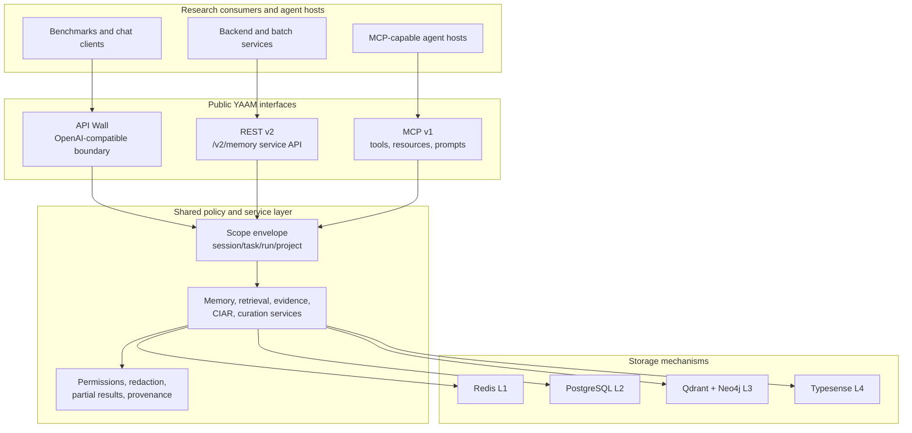
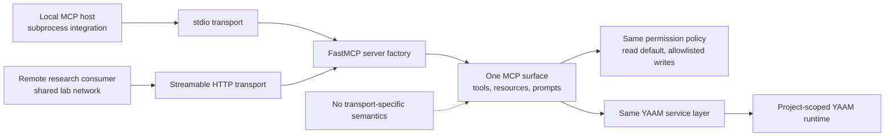
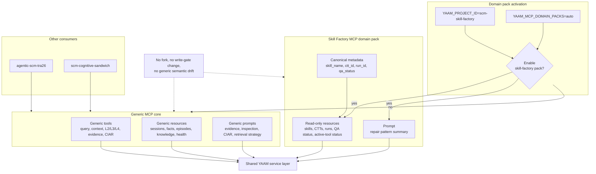

# From Service-Bound Memory To Adaptive Agent-Host Interfaces: YAAM MCP Evolution And Domain-Pack Extensibility

**Status:** Research note for future journal article  
**Date:** 2026-05-30  
**Scope:** MCP interface evolution, requirements-driven design, dual transport strategy, and Skill Factory domain-pack extensibility  
**Related CIAR note:** deferred to a dedicated future artifact

## Abstract

This note records the architectural evolution of YAAM from a November 2025 memory-tier prototype into a May 2026 consumer-facing, MCP-enabled memory service. The central change was not only the addition of a new protocol adapter, but a reframing of YAAM as a public, auditable interface layer for multiple research systems. The work combined external requirements intake, interface hypothesis evaluation, service-layer extraction, dual MCP transport support, project-scoped deployment, and a first optional domain pack for the `scm-skill-factory` research project. The resulting design preserves generic REST and MCP behavior for other consumers while allowing Skill Factory-specific resources and prompts to appear only under the matching project namespace. This provides a concrete example of how YAAM can support project-specific scientific workflows without fragmenting into separate forks.

## 1. Historical Baseline: November 2025

The November 2025 repository history shows YAAM as an increasingly complete memory substrate rather than a stable public integration product. The major foundations were already present or actively emerging:

- the L2 working-memory tier and L3/L4 memory tiers were implemented around early November 2025;
- the first CIAR scoring implementation and ADR alignment work had landed;
- infrastructure verification scripts and DBMS connectivity checks had been added;
- multi-provider LLM client scaffolding and provider adapters were under active development.

Representative git anchors:

| Date | Commit | Relevance |
| --- | --- | --- |
| 2025-11-02 | `41635bb` | ADR-004 became the single source of truth for CIAR formula consistency. |
| 2025-11-03 | `cfa9ac1` | L2 working-memory tier reached the Week 2 implementation milestone. |
| 2025-11-03 | `d935471` | L3 episodic and L4 semantic tiers reached the Week 3 implementation milestone. |
| 2025-11-12 | `e6e704a` | CIAR scoring system implementation was added. |
| 2025-11-15 | `b0e2587`, `865cf96`, `9936e42` | Multi-provider LLM client scaffolding and adapters matured. |

This baseline was important but incomplete from the perspective of external research consumers. YAAM had a layered memory mechanism and internal policy ideas, but it did not yet have a stable agent-host interface, a service-layer contract shared across interfaces, a documented consumer readiness process, or a strategy for project-specific requirements. In other words, it was closer to a memory subsystem than to a reproducible research infrastructure component.

The external review feedback preserved in [docs/notes/28-03-2026-emas-openreview-response.md](28-03-2026-emas-openreview-response.md) reinforced this gap. Reviewers asked for clearer mechanism definitions, stronger empirical evidence, and more precise positioning relative to existing memory systems. The May 2026 MCP work directly responds to part of that critique by turning interface behavior, requirement coverage, and validation evidence into versioned artifacts rather than implicit engineering knowledge.

## 2. Problem Reframing In May 2026

By May 2026, the central question shifted from "can YAAM store and retrieve memory across tiers?" to "can research agents and benchmark systems safely consume YAAM as an external capability?" That reframing required explicit public interfaces, scope boundaries, and evidence that consumers could validate behavior without coupling to storage internals.

The initial interface analysis in [docs/RFC/2026-05-24-yaam-interface-evolution-to-mcp-initial-findings.md](../RFC/2026-05-24-yaam-interface-evolution-to-mcp-initial-findings.md) established three distinct public roles:

| Interface | Role |
| --- | --- |
| API Wall | OpenAI-compatible benchmark and chat boundary. |
| REST v2 | Backend, batch, and service-to-service integration boundary under `/v2/memory/...`. |
| MCP v1 | Agent-host interface for discoverable tools, read-only resources, prompts, context assembly, evidence, and controlled writes. |

This separation became a core design decision. The API Wall was not expanded into a memory-control interface because it optimizes for black-box benchmark compatibility. REST v2 was not forced to carry agent-host discovery semantics. MCP was not allowed to become a raw database gateway. Instead, MCP became a new adapter over shared YAAM service functions.

This decision also preserved the "mechanism versus policy" boundary that had been present in the earlier architecture. Storage adapters remained mechanisms. Public interfaces, scope envelopes, permission policy, evidence assembly, CIAR explanation, and domain views live above the storage layer.



## 3. Requirements Intake From Research Consumers

The requirements analysis in [docs/requirements/2026-05-24-customer-requirements-analysis.md](../requirements/2026-05-24-customer-requirements-analysis.md) gathered input from six research or benchmark consumers:

- TRA;
- iAIMS;
- Skill Factory;
- SCM Cognitive Sandwich;
- Maritime Port Sandbox;
- SCM-Cert-Bench.

The resulting registry in [docs/requirements/yaam-requirements-registry.md](../requirements/yaam-requirements-registry.md) made a key pattern visible. Most consumers needed the same generic memory capabilities, but several also needed domain-specific views.

The shared generic requirements became the foundation for MCP v1:

| Requirement family | Registry IDs | MCP consequence |
| --- | --- | --- |
| Distinct public interfaces | `YAAM-REQ-0001`, `YAAM-REQ-0004` | Preserve API Wall, REST v2, and MCP as separate surfaces. |
| MCP memory query and context | `YAAM-REQ-0002`, `YAAM-REQ-0003` | Add `yaam.memory.query` and `yaam.memory.get_context`. |
| Scoped L2/L3/L4 operations | `YAAM-REQ-0005` to `YAAM-REQ-0008` | Expose tier operations through service-backed tools, not direct DBMS calls. |
| Provenance and scope | `YAAM-REQ-0009`, `YAAM-REQ-0010` | Normalize requests into a shared scope envelope. |
| Safe MCP behavior | `YAAM-REQ-0011` to `YAAM-REQ-0013` | Keep resources read-only, redact sensitive data, allowlist writes. |
| Observability and health | `YAAM-REQ-0014`, `YAAM-REQ-0015` | Carry trace context and expose health/config inspection. |
| Evidence and CIAR inspection | `YAAM-REQ-0016`, `YAAM-REQ-0017`, `YAAM-REQ-0018` | Provide evidence tables, CIAR explanation, and partial-result semantics. |

Skill Factory then contributed a narrower but important set of project-specific requirements:

| Requirement | Need |
| --- | --- |
| `YAAM-REQ-0022` | Store and query generation, QA, and curation memory for Skill Factory workflows. |
| `YAAM-REQ-0023` | Provide MCP resources for skills, CTTs, and runs. |
| `YAAM-REQ-0032` | Support domain-specific prompt templates. |

This split was scientifically useful: it forced YAAM to distinguish between generic memory infrastructure and project-specific research affordances.

## 4. Interface Hypotheses And Final Transport Strategy

Several interface hypotheses were evaluated before the final MCP strategy stabilized.

| Hypothesis | Outcome | Reason |
| --- | --- | --- |
| Use the API Wall as the memory interface | Rejected | The API Wall is optimized for black-box chat and benchmark isolation, not memory capability discovery. |
| Use REST v2 only | Limited | REST v2 remains essential for batch and backend integrations, but it does not provide agent-host discovery of tools, resources, and prompts. |
| Allow direct library or LangChain tool coupling | Rejected | Consumers explicitly needed stable public contracts rather than calls into YAAM internals. |
| Implement stdio-only MCP | Accepted as reference transport, but insufficient alone | Stdio is mature and simple for local MCP hosts, but shared consumer testing needs a central endpoint. |
| Implement HTTP-only MCP | Rejected as sole strategy | HTTP is better for shared deployment, but local subprocess integration remains valuable and simpler for many agent hosts. |
| Support both stdio and Streamable HTTP over one surface | Accepted | This preserves local maturity and enables shared lab/consumer deployment without diverging semantics. |

The final strategy is documented in [docs/specs/spec-mcp-v1-implementation.md](../specs/spec-mcp-v1-implementation.md). YAAM supports:

- `stdio` as the reference local transport for MCP hosts such as Codex, Claude-like subprocess integrations, and developer validation;
- `streamable-http` as the shared deployment transport for consumer systems connecting to a centrally operated YAAM runtime, such as the `skz-data-lv` endpoint used during readiness testing.

Both transports expose the same tools, resources, prompts, permissions, and service-layer contracts. Streamable HTTP is therefore a deployment extension, not a second semantic API.



## 5. MCP v1 Architecture

The MCP implementation plan in [docs/plan/2026-05-24-mcp-v1-implementation-plan.md](../plan/2026-05-24-mcp-v1-implementation-plan.md) describes the engineering sequence: SDK approval, server skeleton, shared contracts, permission policy, memory services, unified retrieval, CIAR/evidence services, REST refactoring, MCP tools, resources, prompts, observability, and contract tests.

The implemented MCP v1 contract has several properties that matter for a future scientific article.

First, MCP is a service adapter. It calls the shared service layer under `src/memory/services/`; it does not call `src/storage/` adapters directly and does not expose LangChain tools as customer-facing contracts. This is the architectural move that keeps mechanism and policy separate.

Second, MCP is read-heavy by default. Resources are read-only, read tools are enabled, and mutating or lifecycle tools are denied unless explicitly allowlisted by server-side configuration. This matches the safety requirements from consumers and is important for benchmark integrity.

Third, MCP responses are structured. The contract includes provenance, warnings, partial-result indicators, structured errors, health/config inspection, evidence rows, CIAR explanation, redaction, and trace metadata. This makes MCP suitable not only for runtime agent use, but also for audit and research analysis.

Fourth, MCP is tested as a protocol surface. The repository includes deterministic contract tests for stdio and Streamable HTTP behavior, plus live gates for shared deployment. This matters because a paper claim about "MCP support" would otherwise be too vague.

## 6. Operational Hardening For Reproducible Consumer Testing

The MCP work was accompanied by operational hardening needed to make consumer testing meaningful.

Project namespaces were introduced so each consumer can run in an isolated YAAM namespace. For example:

| Project id | L3 default | L4 default |
| --- | --- | --- |
| `agentic-scm-tra26` | project-derived Qdrant collection | project-derived Typesense collection |
| `scm-skill-factory` | project-derived Qdrant collection | project-derived Typesense collection |
| `test` | `yaam-test-episodes` | `yaam-test` |

The runtime was also hardened around provider and observability configuration:

- OpenRouter generation defaults were aligned to `tencent/hy3-preview`;
- embeddings were aligned to `qwen/qwen3-embedding-8b` with 4096 dimensions;
- production images were slimmed by moving local `sentence-transformers` and Torch/CUDA dependencies out of the main runtime path;
- Phoenix/OpenTelemetry was moved to batch span processing for production-like deployments;
- interface containers received restart and healthcheck behavior for readiness gates.

The report [docs/reports/2026-05-28-yaam-skz-data-lv-consumer-readiness-e2e-report.md](../reports/2026-05-28-yaam-skz-data-lv-consumer-readiness-e2e-report.md) is especially valuable because it preserves a failure-and-repair sequence. The first Streamable HTTP readiness run exposed real runtime issues: L3 vector-dimension mismatch, deprecated OpenRouter defaults, Typesense health/schema problems, and MCP HTTP log noise. These findings were subsequently addressed. This is stronger evidence than a clean demo because it documents how the interface design was made operationally robust.

The later gate report [docs/reports/2026-05-30-yaam-consumer-readiness-gate-report.md](../reports/2026-05-30-yaam-consumer-readiness-gate-report.md) records the transition to a shared endpoint that could serve first-wave consumers with REST and MCP available.

## 7. Project-Specific Extensibility Through Domain Packs

The most recent Skill Factory work is a concrete demonstration of adaptive interface design.

The Skill Factory readiness report, summarized in [docs/integrations/consumer-readiness-2026-05-30/consumer-readiness-results-register.md](../integrations/consumer-readiness-2026-05-30/consumer-readiness-results-register.md), showed that generic YAAM behavior was useful: REST health and context, MCP discovery, OpenRouter/Qwen runtime configuration, L2/L3/L4 synthetic writes, curation writes, evidence, CIAR, and default write-safety all passed.

However, the report also identified project-specific gaps:

- no first-class views by `skill_name`;
- missing or partial CTT and run resources;
- no first-class QA status or active-tool status run views;
- no domain-specific repair pattern prompt.

There were three possible responses:

1. fork YAAM for Skill Factory;
2. add Skill Factory resources globally to the generic MCP surface;
3. add optional MCP domain packs.

The chosen solution was the third option. It preserves generic behavior for other consumers while allowing the Skill Factory project to see additional resources and prompts.

Current configuration:

```bash
YAAM_MCP_DOMAIN_PACKS=auto
YAAM_PROJECT_ID=scm-skill-factory
```

With `auto`, the Skill Factory pack appears only when the project namespace is `scm-skill-factory`. Operators may also set:

```bash
YAAM_MCP_DOMAIN_PACKS=none
YAAM_MCP_DOMAIN_PACKS=skill-factory
```

The Skill Factory pack adds read-only resources:

- `yaam://skills/{skill_name}`
- `yaam://ctts/{ctt_id}`
- `yaam://runs/{run_id}/episodes`
- `yaam://skill-factory/qa-status/{qa_status}/runs`
- `yaam://skill-factory/active-tool-status/{active_tool_status}/runs`

It also adds:

- `yaam.prompt.repair_pattern_summary`

The pack relies on canonical metadata supplied through existing L2/L3/L4/curation writes:

```json
{
  "domain": "skill_factory",
  "skill_name": "example-skill",
  "ctt_id": "ctt-example",
  "run_id": "run-example",
  "qa_status": "failed",
  "active_tool_status": "needs_repair",
  "sandbox_outcome": "timeout",
  "repair_action": "tighten tool schema",
  "artifact_kind": "skill_manifest"
}
```

This design is important because it avoids a false tradeoff between genericity and usefulness. YAAM can remain a shared memory substrate while presenting domain-specific read views to projects that need them. The domain pack is additive, read-only, service-backed, and namespace-gated. It does not change generic tool semantics, write gates, storage contracts, or REST behavior.



For the future paper, this is a strong case study: a consumer found a real domain gap; the architecture absorbed the gap as an optional interface extension rather than as a fork.

## 8. Consumer Readiness Evidence

The May 30 consumer readiness wave is documented in [docs/integrations/consumer-readiness-2026-05-30/consumer-readiness-results-register.md](../integrations/consumer-readiness-2026-05-30/consumer-readiness-results-register.md).

### 8.1 agentic-scm-tra26

The `agentic-scm-tra26` run passed. It was not merely a connectivity check. It exercised:

- REST health;
- L2 store, retrieve, and isolation;
- L3 assimilation and retrieval after assimilation;
- L4 finalization;
- public memory query leakage guard;
- MCP discovery and read paths;
- MCP evidence table behavior;
- default denial for MCP writes;
- negative validation for missing content.

This provides evidence that the generic REST/MCP surfaces can deliver practical value to a TRA-style research consumer without direct storage access.

### 8.2 scm-skill-factory

The `scm-skill-factory` run passed with findings. It demonstrated generic YAAM value for Skill Factory, including REST context, MCP read surfaces, L2/L3/L4 writes, curation, evidence, CIAR, and write-safety behavior. The findings were not generic runtime failures. They were domain-view gaps that became the motivation for the optional Skill Factory MCP domain pack.

As of the domain-pack implementation, local validation evidence is:

```text
761 passed, 142 skipped
```

This validates the implementation at the repository test level, but it is not yet a substitute for consumer re-verification. The next Skill Factory readiness run should prove that the new resources and prompt are not only discoverable, but useful for the project workflow.

## 9. Scientific Significance For The Future Paper

This work contributes to a future YAAM paper in three ways.

### 9.1 Architectural contribution

YAAM now has an explicit separation between:

- benchmark/chat compatibility through the API Wall;
- service and batch integration through REST v2;
- agent-host discovery and inspection through MCP v1.

This is a stronger architectural claim than "YAAM has memory tiers". It shows how a multi-tier memory system can be exposed safely to heterogeneous agent ecosystems without collapsing all consumers into one interface.

### 9.2 Methodological contribution

The MCP surface was not designed only from internal assumptions. It was shaped by requirements from TRA, iAIMS, Skill Factory, SCM Cognitive Sandwich, Maritime Port Sandbox, and SCM-Cert-Bench. Those requirements were normalized into a registry, linked to implementation plans, tested through consumer readiness assignments, and tracked through findings.

For a scientific article, this provides a traceable design methodology:

1. collect external research-system requirements;
2. normalize requirements into stable IDs;
3. classify shared versus project-specific needs;
4. implement shared service-backed surfaces first;
5. validate through consumer-owned readiness reports;
6. absorb project-specific needs through optional domain extensions.

### 9.3 Engineering contribution

The dual transport and domain-pack design show that MCP can be used as more than a tool-call wrapper. In YAAM, MCP becomes a discoverable, auditable, project-aware interface layer:

- `stdio` supports local agent-host integration;
- Streamable HTTP supports shared deployments;
- project namespaces isolate consumer data;
- domain packs expose project-specific views only where appropriate;
- write and lifecycle behavior remains controlled by server-side policy.

This combination is a practical answer to a common enterprise MAS tension: research projects want custom memory views, but platform maintainers need stable generic contracts.

## 10. Limitations And Next Evidence Needed

This note should not be read as a final empirical claim that YAAM improves all downstream research workflows. The evidence is currently strongest for interface readiness and controlled synthetic workflows.

Known limitations:

- the Skill Factory domain pack still needs consumer re-verification;
- Phoenix span correlation evidence is partial in consumer reports;
- full production workflows are not the same as synthetic readiness scripts;
- direct L4 search/readback evidence should be strengthened in future readiness reports;
- CIAR requires a separate formal scientific treatment, including formulas, calibration, and empirical effect;
- domain packs are currently proven for Skill Factory only, not for all future project families.

The next evidence package for a journal article should include:

- a post-domain-pack Skill Factory readiness report;
- a Cognitive Sandwich readiness report, especially if artifact lineage remains a major differentiator;
- quantitative latency and success/failure tables for REST and MCP operations;
- Phoenix trace export summaries linked to specific readiness runs;
- ablation-style comparison of generic MCP-only versus domain-pack-assisted workflows;
- a dedicated CIAR design and validation note.

## Appendix A: Requirements To Design Decisions

| Requirement | Design decision | Evidence artifact |
| --- | --- | --- |
| `YAAM-REQ-0001`, `YAAM-REQ-0004` | Keep API Wall, REST v2, and MCP distinct. | [MCP initial findings](../RFC/2026-05-24-yaam-interface-evolution-to-mcp-initial-findings.md), [MCP spec](../specs/spec-mcp-v1-implementation.md) |
| `YAAM-REQ-0002`, `YAAM-REQ-0003` | Add MCP memory query and context assembly. | [MCP spec](../specs/spec-mcp-v1-implementation.md) |
| `YAAM-REQ-0005` to `YAAM-REQ-0008` | Expose L2/L3/L4 through service-backed tools and REST routes. | [MCP implementation plan](../plan/2026-05-24-mcp-v1-implementation-plan.md) |
| `YAAM-REQ-0009`, `YAAM-REQ-0010` | Normalize caller context into scope envelopes and preserve provenance. | [MCP planning freeze](../RFC/2026-05-24-yaam-mcp-v1-planning-freeze.md) |
| `YAAM-REQ-0011` to `YAAM-REQ-0013` | Keep resources read-only; allowlist writes; redact sensitive data. | [MCP spec](../specs/spec-mcp-v1-implementation.md) |
| `YAAM-REQ-0014`, `YAAM-REQ-0015` | Add trace and health/config inspection. | [Consumer readiness gate report](../reports/2026-05-30-yaam-consumer-readiness-gate-report.md) |
| `YAAM-REQ-0016`, `YAAM-REQ-0017`, `YAAM-REQ-0018` | Add Evidence Table, CIAR explanation, and partial-result policy. | [MCP spec](../specs/spec-mcp-v1-implementation.md) |
| `YAAM-REQ-0022`, `YAAM-REQ-0023`, `YAAM-REQ-0032` | Add optional Skill Factory MCP domain pack. | [Skill Factory readiness instructions](../integrations/consumer-readiness-2026-05-30/scm-skill-factory-test-instructions.md), [Results register](../integrations/consumer-readiness-2026-05-30/consumer-readiness-results-register.md) |

## Appendix B: Timeline Anchors

| Period | Anchor | Interpretation |
| --- | --- | --- |
| 2025-11-02 to 2025-11-15 | `41635bb`, `cfa9ac1`, `d935471`, `e6e704a`, `9936e42` | Memory tiers, CIAR, infrastructure, and provider scaffolding matured. |
| 2026-05-24 | `ede5ff0`, `3d9b196`, `96d2f49`, `6b1b8df`, `f71287f` | MCP v1 planning, service layer, REST refactor, surface contracts, and tracing matured. |
| 2026-05-28 | `ea6a9d0`, `39f9796`, `f83df5c`, `fb7b793`, `408c879` | Consumer readiness docs, Streamable HTTP transport, runtime defaults, image slimming, and Typesense/OpenInference hardening. |
| 2026-05-30 | `1265796`, `b6c6151`, `0ddcb7f` | Consumer readiness reports, OpenRouter runtime hardening, and Skill Factory domain-pack implementation. |

## Appendix C: Consumer Readiness Artifacts

| Consumer | Verdict | Artifact |
| --- | --- | --- |
| `agentic-scm-tra26` | `pass` | [TRA readiness report](../integrations/consumer-readiness-2026-05-30/reports/20260530T153445Z-agentic-scm-tra26-full-synthetic-report.md) |
| `scm-skill-factory` | `pass-with-findings` | [Skill Factory readiness report](../integrations/consumer-readiness-2026-05-30/reports/2026-05-30-scm-skill-factory-readiness-report.md) |
| Consumer wave register | living register | [Results register](../integrations/consumer-readiness-2026-05-30/consumer-readiness-results-register.md) |
