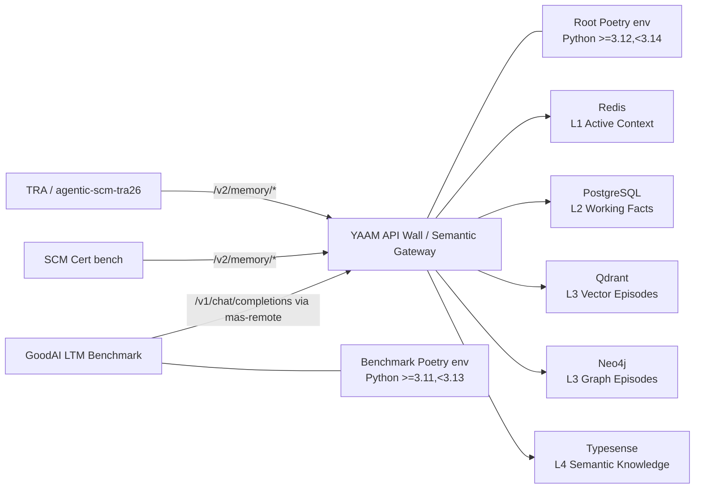

# YAAM Project History: GoodAI Benchmark, API Wall, Consumers, and Deployment Topology

**Date:** 2026-05-18  
**Author:** Codex research pass  
**Scope:** Repository history and architecture narrative for YAAM / MAS Memory Layer, with emphasis on the GoodAI LTM Benchmark adoption, split Poetry environments, API Wall, consumer projects, and current skz-* deployment topology.

## 1. Executive Summary

YAAM started as a four-tier memory substrate for multi-agent systems: L1 active context in Redis, L2 working facts in PostgreSQL, L3 episodic memory over Qdrant and Neo4j, and L4 semantic memory in Typesense. ADR-003, accepted on 2025-11-02, is the main architectural anchor for this shape.

By late December 2025, the project had moved beyond storage adapters into an agent integration layer: LangGraph-style orchestration, memory tools, async execution, and policy surfaces for multi-agent behavior. ADR-007 captures this turn from "memory implementation" to "orchestration layer for agents."

On 2026-02-04, the repository history shows the commit `3cdb45c` with subject `Brought in goodai-benchmark`. This brought the GoodAI LTM Benchmark into `benchmarks/goodai-ltm-benchmark/` as a substantial embedded benchmark subproject. That move was useful because it gave YAAM a long-term-memory evaluation harness, but it also introduced dependency and runtime pressure.

The key architectural correction came on 2026-02-10 in ADR-009: YAAM and the GoodAI benchmark were separated by a formal HTTP boundary called the **API Wall**. From that point, GoodAI should behave as "the judge" and YAAM as "the system under test"; benchmark traffic should cross a JSON/HTTP contract instead of importing YAAM internals directly.

The project now has two Poetry environments by design:

- Root YAAM environment at the repository root, targeting Python `>=3.12,<3.14`.
- GoodAI benchmark environment under `benchmarks/goodai-ltm-benchmark/`, targeting Python `>=3.11,<3.13`.

YAAM has also evolved from an internal benchmark target into a reusable semantic memory gateway. Current documented consumers include the TRA project (`agentic-scm-tra26`) through `docs/api/TRA_Integration_Guide_v2.md`. The SCM Cert bench project is a known consumer/stakeholder from operator context and should be treated as a downstream integration requirement even though this exact project name is not yet strongly represented in repository docs.

Operationally, YAAM is best understood as an orchestration layer for a multi-agent memory system whose DBMS backends primarily live on `skz-data-lv`, while YAAM development and API Wall execution have historically lived on `skz-dev-lv`. As of this report, the operator-supplied topology update is important: Redis is no longer available on `skz-dev-lv` / `skz-dev-local`; Redis has moved to `skz-data-lv` / `skz-data-local`. Some older runbooks still describe Redis on `skz-dev-lv`; those should be treated as stale until updated.

## 2. Evidence Sources

This report is based on:

- `docs/ADR/003-four-layers-memory.md`
- `docs/ADR/007-agent-integration-layer.md`
- `docs/ADR/009-decoupling-benchmark-api-wall.md`
- `docs/environment-guide.md`
- `docs/integrations/goodai-benchmark-setup.md`
- `docs/specs/spec-goodai-agent-variant-evaluation-protocol.md`
- `docs/api/TRA_Integration_Guide_v2.md`
- `docs/RFC/RFC014 - YAAM Semantic Gateway API (v2).md`
- `docs/architecture/ImplSpec014 - Semantic Gateway v2.md`
- `docs/integrations/yaam_v2_connection_policy.md`
- `docs/reports/2026-04-05-YAAM-Connectivity-Audit.md`
- `docs/reports/2026-04-15-project_status_delta_report.md`
- `pyproject.toml`
- `benchmarks/goodai-ltm-benchmark/pyproject.toml`
- Git history for `benchmarks/goodai-ltm-benchmark/`, especially commit `3cdb45c` from 2026-02-04.

Host probe for this research pass:

```text
Darwin MacBook-Pro.local
/Users/skazo4nick/research-code/yet-another-agents-memory
```

The root `.venv/` was missing in this local checkout during this research pass. No tests were run because this was a documentation-only report and installing dependencies would modify the local environment.

## 3. Historical Timeline

### 3.1 Foundation: Four-Tier Cognitive Memory

The architecture begins with ADR-003: a production-oriented, four-tier memory hierarchy.

- **L1 Active Context:** Redis for fast, ephemeral conversational turns.
- **L2 Working Memory:** PostgreSQL for significant facts and CIAR-scored working knowledge.
- **L3 Episodic Memory:** Qdrant plus Neo4j for hybrid vector and graph experience storage.
- **L4 Semantic Memory:** Typesense for durable, distilled knowledge.

This is not just a storage stack. The ADR defines lifecycle behavior: promotion, consolidation, distillation, temporal resolution, and eventual consistency. That makes YAAM a memory system rather than a CRUD wrapper around databases.

### 3.2 Agent Integration: From Storage Substrate to Orchestration Layer

ADR-007, accepted on 2025-12-28, marks the next turn. YAAM becomes an integration layer for agents, with specific commitments:

- async-first tools and graph nodes,
- hidden infrastructure context through runtime state instead of LLM-visible IDs,
- supervisor/subgraph topology,
- unified and granular memory tools,
- reducers for parallel execution safety,
- later policy packaging through skills.

This is the point where the project clearly becomes an **orchestration layer for multi-agent memory**, not only a persistence layer. The `src/agents/`, `src/agents/tools/`, `src/memory/`, and `src/storage/` boundaries reflect this split.

### 3.3 GoodAI Benchmark Is Brought In

Git history shows the GoodAI LTM Benchmark entering the repository on:

```text
2026-02-04  3cdb45c  Brought in goodai-benchmark
```

The commit added `benchmarks/goodai-ltm-benchmark/` with runner code, datasets, model interfaces, configurations, reporting templates, and benchmark artifacts. This was a major shift because YAAM gained a concrete long-term-memory evaluation harness.

The immediate development history after that import shows stabilization pressure:

- 2026-02-04: type and storage fixes around the imported benchmark work.
- 2026-02-05: benchmark mypy cleanup and transparency UI work.
- 2026-02-05 to 2026-02-06: Poetry migration and benchmark lockfile additions.
- 2026-02-07 to 2026-02-10: benchmark v2, scheduler tests, automated MAS benchmark runs, and headless benchmark pivot.
- 2026-02-10: ADR-009 planning and dependency restoration/cleanup.

The pattern is clear: GoodAI was first embedded as a practical evaluation engine, then the project had to carve an explicit boundary to avoid benchmark dependencies and assumptions leaking into YAAM itself.

### 3.4 API Wall: The Boundary That Stabilized the Relationship

ADR-009, accepted on 2026-02-10, names the problem directly: the root project and the benchmark had become a split-brain Python environment. The root YAAM project wanted Python 3.12+ and modern agent/storage dependencies, while the benchmark needed Python 3.11-compatible dependencies and its own LTM ecosystem.

ADR-009 therefore defines:

- **Container A:** YAAM / MAS Memory Layer as FastAPI server.
- **Container B:** GoodAI LTM Benchmark as HTTP client.
- **API Wall:** a formal HTTP/JSON boundary between judge and contestant.
- **Data Plane:** OpenAI-compatible `POST /v1/chat/completions`.
- **Control Plane:** benchmark utilities such as session reset and possible memory injection.
- **Headers:** `X-Session-Id`, `X-Mock-Time`, and `traceparent` for state, simulated time, and observability.

This boundary is methodologically important. It keeps the benchmark from importing internal agent classes, touching private memory state, or accidentally coupling to YAAM internals. It also makes benchmark runs more production-like because traffic crosses the same kind of API boundary a real consumer would use.

## 4. Current Repository Shape

### 4.1 Root YAAM Project

The root `pyproject.toml` identifies the project as `mas-memory-layer` and targets:

```toml
python = ">=3.12,<3.14"
```

Its dependency surface includes:

- storage clients: Redis, PostgreSQL, Qdrant, Neo4j,
- LLM providers: OpenAI, Gemini, Groq, Mistral,
- FastAPI and Uvicorn,
- LangGraph / LangChain core,
- Phoenix/OpenTelemetry observability.

This environment owns production behavior, the API Wall, memory tiers, lifecycle engines, storage adapters, and agent orchestration.

### 4.2 GoodAI Benchmark Subproject

The benchmark `pyproject.toml` identifies the project as `goodai-ltm-benchmark` and targets:

```toml
python = ">=3.11,<3.13"
```

It includes benchmark-specific packages such as:

- `goodai-ltm`,
- benchmark runner and reporting dependencies,
- LangChain 1.x stack,
- provider-facing interfaces,
- dataset and reporting utilities.

This environment should remain isolated. It is a consumer of the API Wall, not a library dependency of the root YAAM runtime.

### 4.3 Two Poetry Environments Are Intentional

`docs/environment-guide.md` explicitly documents two separate Poetry environments:

- root: `poetry install --with test,dev`,
- benchmark: `cd benchmarks/goodai-ltm-benchmark && poetry install`.

This is not accidental duplication. It is the concrete operational expression of ADR-009. The split prevents dependency conflicts, especially around Python versions, LangChain versions, provider SDKs, and benchmark-only tooling.

## 5. YAAM as API Wall and Semantic Gateway

The project now has two related but distinct API surfaces.

### 5.1 Benchmark API Wall

The benchmark-facing wall is implemented around `src/server.py` and the OpenAI-compatible `POST /v1/chat/completions` surface. It exists to support GoodAI-style evaluation and variant comparison without internal imports.

The GoodAI runner should use `mas-remote` and `AGENT_URL` so benchmark turns cross the API boundary. This is reinforced by the GoodAI setup docs, runbooks, and the GoodAI agent variant evaluation protocol.

### 5.2 Consumer-Facing Semantic Gateway v2

The TRA integration docs and RFC-014 define a higher-level v2 gateway:

- `POST /v2/memory/l1/turns`
- `POST /v2/memory/l2/facts`
- `POST /v2/memory/l3/assimilate`
- `POST /v2/memory/l3/query`
- `POST /v2/memory/l4/finalize`

The design principle is semantic offloading. TRA and similar consumers should not generate embeddings, Cypher, or internal storage operations. They send natural-language observations, task/session/agent metadata, and trace context; YAAM handles routing, embedding, graph extraction, indexing, search, and provenance.

This is the architectural bridge from "benchmark-compatible memory agent" to "shared memory infrastructure for consumer applications."

## 6. Consumers and Stakeholders

### 6.1 TRA Project

`docs/api/TRA_Integration_Guide_v2.md` names `agentic-scm-tra26` as the target audience. It frames the relationship as:

- **TRA:** the brain, responsible for SCM reasoning, orchestration, task execution, and consensus.
- **YAAM:** the spinal cord, responsible for reflexive semantic memory operations.

TRA is expected to call YAAM v2 with `session_id`, `agent_id`, task/provenance metadata, and W3C `traceparent` headers so Phoenix can correlate the external reasoning loop with YAAM's internal LLM and database spans.

### 6.2 SCM Cert Bench Project

The SCM Cert bench project is a known downstream consumer/stakeholder from operator context supplied for this report. In the repository, the exact project name is not yet strongly documented. However, related SCM artifacts are present:

- SCM scenario fixtures under `tests/data/scm_scenarios/`,
- v2 API E2E tests that read SCM scenario text,
- the TRA integration guide for SCM orchestration,
- RFC-014 authored in the SCM-MAS context.

Recommendation: add a short consumer registry under `docs/integrations/` or `docs/api/` that explicitly lists TRA and SCM Cert bench as supported consumers, with owner, API version, expected base URL, and operational assumptions.

## 7. Deployment Topology

### 7.1 Historical / Documented Topology

Several older documents describe this split:

- YAAM / API Wall execution on `skz-dev-lv`.
- PostgreSQL, Qdrant, Neo4j, and Typesense on `skz-data-lv`.
- Redis historically local to `skz-dev-lv` for L1 active context.

For example, the March 2026 Phoenix validation plan records Redis as local to `skz-dev-lv`, while PostgreSQL/Qdrant/Neo4j/Typesense are on `skz-data-lv`. The April 2026 connectivity audit verifies PostgreSQL, Qdrant, and Typesense on `skz-data-lv`.

### 7.2 Current Operator Update: Redis Moved

As of this report, the operator-provided current state supersedes older runbooks:

- Redis is **not available** on `skz-dev-lv` / `skz-dev-local`.
- Redis has moved to `skz-data-lv` / `skz-data-local`.

This means old instructions that tunnel Redis from `skz-dev-local` or assume `localhost:6379` on `skz-dev-lv` are stale. Any current runbook should point Redis traffic at the data node or an SSH tunnel to `skz-data-local`.

Practical implication:

```text
Old assumption:
  skz-dev-lv: Redis on localhost:6379

Current assumption:
  skz-data-lv: Redis on data-node Redis endpoint
  skz-dev-lv: no local Redis dependency assumed
```

This also supports the larger direction: DBMS services should be centralized on `skz-data-lv`, while YAAM should eventually move there as well.

### 7.3 Current Logical Topology



Operational placement:

- `skz-dev-lv`: historical development/API Wall host.
- `skz-data-lv`: primary DBMS host; currently includes Redis per operator update.
- Planned target: move YAAM fully to `skz-data-lv` to reduce cross-node latency and topology drift.

## 8. Why the API Wall Matters

The API Wall is not just an implementation detail. It protects the project in four ways:

1. **Dependency isolation:** root YAAM and GoodAI can evolve independently.
2. **Methodological validity:** benchmark code cannot call internal methods unavailable to real consumers.
3. **Deployment parity:** benchmark runs exercise a production-like HTTP surface.
4. **Observability:** `traceparent`, API Wall spans, and response metadata allow black-box and glass-box diagnosis.

This is especially important now that YAAM has real consumers. The same discipline that keeps GoodAI isolated also helps TRA and SCM Cert bench integrate through stable contracts instead of repository internals.

## 9. Planned Direction

### 9.1 Decouple Benchmark and YAAM into Separate Repositories

The embedded benchmark served its purpose as a fast local integration harness. The next architectural step is to split YAAM and GoodAI benchmark code into separate repositories.

Expected benefits:

- clearer ownership,
- less repository weight,
- independent dependency lifecycles,
- less temptation to patch benchmark and YAAM together,
- cleaner API-contract testing.

Constraint: the API Wall contract and benchmark run protocol must be preserved before the split. The JSON/HTTP contract should become the shared artifact, not shared Python code.

### 9.2 Move YAAM Fully to skz-data-lv

The current state already places most DBMS services on `skz-data-lv`, and Redis has now moved there too. Moving YAAM itself to `skz-data-lv` would simplify runtime topology:

- fewer cross-node database hops,
- fewer SSH tunnels,
- fewer stale localhost assumptions,
- simpler health checks,
- closer placement of API Wall and storage backends.

This should be done with a small runbook update first, then a staged deployment cutover.

### 9.3 Develop an MCP Interface for YAAM Consumers

The v2 Semantic Gateway is an HTTP API for application integration. The planned MCP interface would make YAAM usable as a model-facing tool substrate for consumer apps and agent runtimes.

Good MCP candidates:

- `yaam_l2_store_fact`
- `yaam_l2_retrieve_facts`
- `yaam_l3_assimilate`
- `yaam_l3_query`
- `yaam_l4_finalize`
- `yaam_health`

The MCP interface should remain above the mechanism layer. It should call the API Wall / Semantic Gateway contract rather than importing storage adapters directly. That preserves the same boundary discipline learned from the GoodAI integration.

## 10. Documentation Gaps and Recommended Fixes

1. **Update Redis topology docs.** Older docs still place Redis on `skz-dev-lv`. They should be revised to state that Redis is now on `skz-data-lv`.
2. **Add consumer registry.** TRA is documented, but SCM Cert bench should be explicitly listed as a consumer with its API expectations.
3. **Mark old Redis tunnel runbooks as historical or update them.** `docs/runbooks/runbook-variant-a-smoke-macbook-to-skz.md` currently assumes Redis on `skz-dev-lv`.
4. **Promote API contract artifacts.** Before repository decoupling, freeze the benchmark-facing `/v1/chat/completions` and consumer-facing `/v2/memory/*` contracts as the shared interface.
5. **Plan YAAM migration to `skz-data-lv`.** Record target ports, service ownership, secrets handling, Phoenix topology, and rollback steps.
6. **Define MCP v0.1.** Start with thin wrappers over v2 endpoints rather than new memory semantics.

## 11. Bottom Line

YAAM's development history can be read as a sequence of boundary discoveries:

1. Four-tier memory made the storage and lifecycle model explicit.
2. Agent integration made YAAM an orchestration layer.
3. GoodAI brought a real benchmark pressure test.
4. API Wall restored isolation and methodological validity.
5. TRA and SCM consumers turned YAAM into shared semantic infrastructure.
6. The next boundary is repository and deployment decoupling: separate benchmark from YAAM, move YAAM to the data node, and expose MCP for downstream applications.

